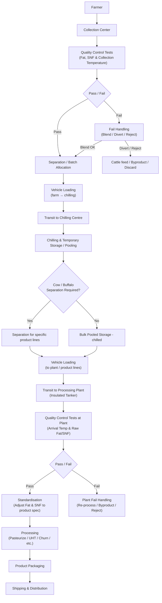

# Swades Milk Supply Chain Analytics (Cow Milk)

<p align="center">

</p>

## What?

**Swades Milk Multi State Co-Operative Society Ltd.** (Mononymously known as *"Swades Milk"*) is a large co-operative milk society which operates in the states like Maharashtra, Gujarat, Haryana, Rajasthan and Tamil Nadu. It has a large supply chain of milk and milk products, which starts at the farms located in several villages. Milk is brought to collection centres by the farmers, and it is then chilled and processed to manufacture variety of products. The milk is processed in plants at different locations with different product specializations. This project is focused on the analysis and performance monitoring of all the core elements of this supply chain, using data collected in the first semester of 2025. The analysis is performed with exclusive use of Microsoft Excel. Various features of Excel, from functions to data modelling, relations to Power Query, have all been applied to complete the project. Several important recommendations and KPIs are provided for the upper management of Swades Milk, which are very effective in overall optimization of the supply chain and increasing the benefits to our key players - **The Farmers of India..!**

## Disclaimer
This project is an academic case study. The name "Swades Milk" OR "Swades Milk Multi State Co-Operative Society Ltd." is a fictional name, and must not be confused with "[Swadesh Milk Products Pvt. Ltd](https://shuddhmilk.com/)", which is a real company. This project is not affiliated with them in any manner.

## Why?

The objectives of this project are:
1. To understand a typical dairy supply chain and model it using data.
2. Apply data cleaning, modelling and analysis features of Microsoft Excel to monitor the performance of the supply chain.
3. Implement relevant KPIs to facilitate data-driven decision making.
4. Suggest recommendations based on the findings for potential improvements in the operations.

## Typical Dairy Supply Chain

Typically, milk flows like this in any dairy cooperative:


## Dataset
The dataset has the following tables arranged in separate sheets in the Excel file:

```
1. Supply Chain Data
2. Farms Data
3. Collection Centers Data
4. Chilling Centers Data
5. Vehicles Data
6. Co-Operatives Data
7. Plants Data
```
The Supply Chain Data table has all the crucial details about every collection, ranging from farms to transit details and timestamps. It also has technical parameters like fat and SNF readings, temperatures and details of processed products. Specifics about every entity in the Supply Chain Data table are included in their dedicated tables in the respective sheets.

### Some notes about the dataset:
1. **This dataset is created after studying a larger, proprietary dataset.** It's a subset specifically chosen to learn about the structure and nuances of a typical dairy supply chain. It was later modified to make it Excel-friendly, so that it would be easy to process and analyse in Excel.
2. **This dataset only has Cow milk data.** It does not have Buffalo milk data. This was an intentional choice, to reduce the data volume and to make it friendly with exploration and experiments. Also, typical automated data collection and logging systems used by commercial dairies separate the data about milk types, because of their unique composition and processed products.
3. **Assignment of the milk for products is more flexible, in terms of their fat and SNF values.** This has to with modern milk processing - standardization, blending, cream separation, SNF adjustments and homogenization. In traditional practices, high-fat milk is preferred for high fat products like ghee, but newer dairy technologies enable to process all kinds milk for a range of products, including high-fat ones like ghee. This is done by performing the above processes, which makes the milk compatible with specific product requirements, as well as the standards defined by the FSSAI. That's why a lot of "Cow-specific" products are seen in the market nowadays, like Cow Ghee and Cow Butter.
4. **Capacities are not included.** Capacity utilization is very crucial metric in supply chain, but it has not been included in this dataset. As previously discussed, the dataset is a subset, and therefore analysing capacities will always show underutilization of the resources, adding little value to it in terms of analytics.
5. **Vehicles work in shifts.** Vehicles are rotated across zones in shifts, which reflects real cooperative fleet practices where drivers and trucks serve different routes on different days.

## How?
In order to analyze the Cow milk supply chain, the following procedure was defined and followed:
1. **Talks with people.** In order to study the milk cooperative industry and to find possible ways to learn about their workflow, formal discussions with the domain experts in the local area as well as from a nearest (real) milk cooperative were made.
2. **Understanding the supply chain with reports and documents.** The flow of milk was studied from farmers to product lines, with the help of reports and documents that were made temporarily available for this study, by the milk cooperative.
3. **Studying the dataset.** A visit to their nearest plant was made, and a study of their dataset was performed. Key parameters were noted and a strategy to subset the data was formulated.
4. **Subsetting and anonymizing the data.** The dataset was carefully extracted and anonymized in order to keep the supply chain data intact and strip off any other identifiable information.
5. **Cleaning and rearranging the data.** The dataset was cleaned and formatted carefully in Excel.
6. **Data Modelling.** Relationships between the tables were added.
7. **Basic Exploration.** Performed basic EDA operations to understand the data an analytical point of view.
8. **Creating a 3-step top-down analytics report.** Created a KPI sheet, a detailed strategic insights sheet and a dashboard for further drilling in the data.
9. **Presenting the insights.** The insights are now presented here.

## Almost there!
In order to keep the readme file small, the key insights that were found are documented in detail in the [Report.pdf](https://github.com/abhi-deshpande/swades-milk-sc-analytics/blob/main/Report.pdf) file. Further, you can download the [Swades Milk SC Analysis.xlsx](https://github.com/abhi-deshpande/swades-milk-sc-analytics/blob/main/Swades%20Milk%20SC%20Analysis.xlsx) file to take a look at the whole picture.

## Moral of the story?
Milk supply chain is highly real-time and complicated to manage. Catering to different product demands and managing high quality standards is difficult. Being a fast-moving food chain, it increases the burden on stakeholders to take decisions in a very short time. Data helps to deal with the situation, allowing stakeholders to selectively zoom into the components of the chain and diagnose the inefficiencies. Quick actions can be made and improvements caused by them can be monitored quickly. This also helps to keep compliance with the authorities, keeping spoilages low, and ensuring high quality products.

## License
This project and the dataset is made available under [CC BY-NC-SA 4.0.](https://creativecommons.org/licenses/by-nc-sa/4.0/) 
